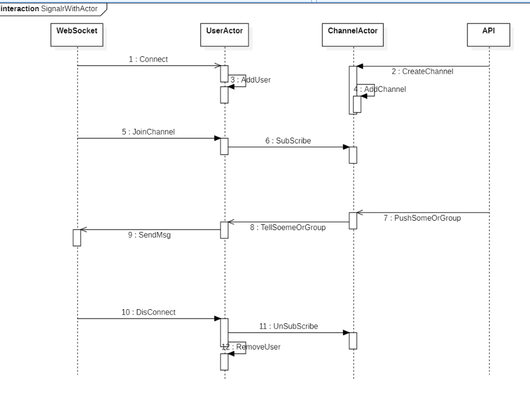
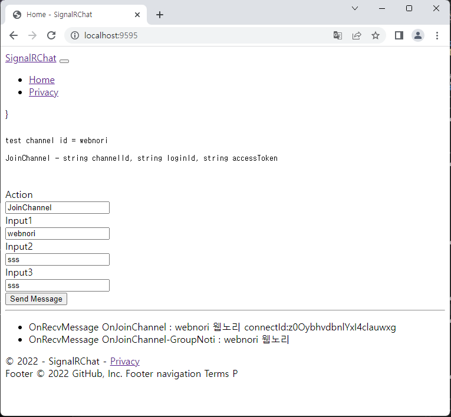
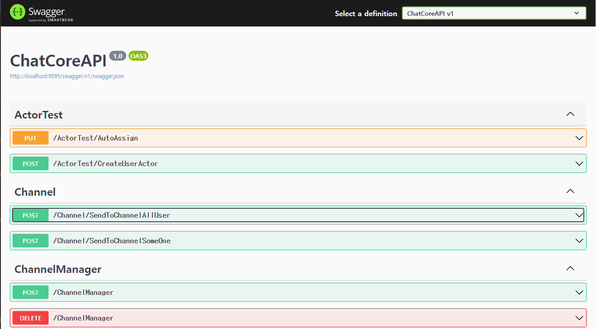

# ChatCore API ( SignalR with Akka.net)

웹소켓(Signalr)이 액터와 연동되어 세션단위 채널관리가 되며 API를 통해 채널 푸시기능을 지원합니다.
도메인에대한 기능은 가지고 있지않으며 여기서 제공하는 채널기능을 이용하여
다음과 같은 다양한 서비스를 커스텀하게 구현할수 있습니다.

- 다중채널지원 채팅솔루션
- 다중채널지원 푸시 시스템
- 채널내 라운드로빈 처리기능(채팅상담 분배)




## WebSocket TEST TOOL



- 채널에 최초접속 이후에는 API를 이용하여 다양한 사용자에게 실시간 메시지를 보낼수 있습니다.
- 채널조인에 성공하면 ConnectID를 획득할수 있으며, 이 아이디는 특정사용자에게 메시지를 보낼때 활용되는 값입니다.


## WebAPI



- ChannelManager : 채널을 생성하고 삭제할수 있습니다.
- Channel : 채널에 접속한 사용자에게 웹소켓 메시지를 보낼수 있습니다.
- ActorTest : 이벤트 자동분배(라운드로빈)등 다양한 기능을 시도해볼수 있습니다.
- 


## 테스트 시나리오

### 서버 채널 생성

```
curl -X 'POST' \
  'http://localhost:9595/ChannelManager?channelId=test1&channelName=%ED%85%8C%EC%8A%A4%ED%8A%B81' \
  -H 'accept: text/plain' \
  -d ''
```

### WS 채널/그룹 가입

#### 채널가입

```
JoinChannel(test1,testtoken,testdata)

Result:
OnRecvMessage OnJoinChannel : test1 테스트1 connectId:gfcn_xBKSqLlHoDzrIKABg
```

#### 채널내 그룹가입
```
JoinGroup(test1,testtoken,group1)
```


### 메시지 발송

#### 특정채널

```
curl -X 'POST' \
  'http://localhost:9595/Channel/SendToChannelAllUser' \
  -H 'accept: text/plain' \
  -H 'Content-Type: application/json' \
  -d '{
  "eventType": "test",
  "channelId": "test1",
  "channelName": "테스트1",
  "eventData": "test data",
  "subGroup": ""
}'
```

#### 특정그룹

```
curl -X 'POST' \
  'http://localhost:9595/Channel/SendToChannelAllUser' \
  -H 'accept: text/plain' \
  -H 'Content-Type: application/json' \
  -d '{
  "eventType": "test",
  "channelId": "test1",
  "channelName": "테스트1",
  "eventData": "test data",
  "subGroup": "testgroup1"
}'
```

#### 특정채널에 라운로로빈 메시지
```
curl -X 'POST' \
  'http://localhost:9595/Channel/AutoAsign' \
  -H 'accept: text/plain' \
  -H 'Content-Type: application/json' \
  -d '{
  "channelId": "webnori",
  "asignData": "metadata"
}'
```


## CodeReview

[코드리뷰](code-review.md)